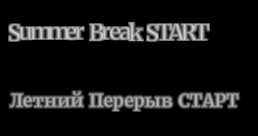
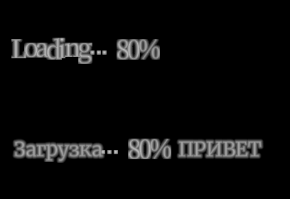

# Sword of Convallaria — Русификатор

Фанатский русский перевод **Sword of Convallaria** (Steam, Unity 2020.3).
Переведено **141 516 уникальных строк** — весь текстовый контент игры:
интерфейс, сюжет, диалоги, навыки, предметы, задания, описания, события.
Игровые шрифты дополнены кириллицей, запечённой в SDF-атласы в родной
конвенции игры — русский текст выглядит как оригинальный.

> Проект некоммерческий, создан фанатами и не связан с XD Inc. / Farlight.
> Распространяется как патч: файлы игры в репозитории отсутствуют,
> модифицированные бандлы выкладываются только в Releases.




---

## Установка (для игроков)

1. Скачайте `SoC_RUS_v0.0.1.zip` из раздела
   [Releases](https://github.com/Anothery/sword-of-convallaria-rus/releases).
2. Полностью закройте игру.
3. Откройте папку игры: `...\Steam\steamapps\common\Sword of Convallaria\`.
4. **Сделайте резервные копии** заменяемых файлов (просто скопируйте их
   куда-нибудь):
   - `assets\lua\lua_dblang_en.unity3d`
   - `assets\localization\en\db_text.unity3d`
   - `assets\localization\en\font.unity3d`
   - `assets\font\font.unity3d`
   - `assets\font\login_font.unity3d`
5. Распакуйте содержимое архива в папку игры **с заменой файлов**
   (структура папок в архиве совпадает с игровой).
6. Запустите игру. В настройках языка должен стоять **English** —
   все тексты будут на русском.

### Удаление / откат

- Верните резервные копии на место, **или**
- Steam: ПКМ по игре → Свойства → Установленные файлы →
  «Проверить целостность файлов игры» — вернёт оригиналы.

### Нюансы

- После обновления игры Steam вернёт оригинальные файлы — повторите
  установку русификатора (или скачайте обновлённую версию из Releases).
- Не переведено: картинки с нарисованным текстом (карточки персонажей,
  баннеры гачи, часть заголовков событий — это текстуры), озвучка и видео.

---

## Структура репозитория

```
tools/    — весь инструментарий (Python 3.10+, см. requirements.txt)
data/     — glossary_ru.json: глоссарий (~420 терминов), обязателен к соблюдению
tm/       — tm_ru.json.gz: память переводов (141 516 строк, ключ = sha1(en)[:16])
docs/img/ — картинки для этого README
```

Установка зависимостей: `pip install -r requirements.txt`
(проверено на UnityPy 1.25.2).

---

## Как устроены данные игры (reverse engineering)

### Где лежат тексты

| Файл | Содержимое |
|---|---|
| `assets/lua/lua_dblang_en.unity3d` | **ВЕСЬ текст игры**: 439 Lua-таблиц (TextAsset'ы) |
| `assets/localization/en/db_text.unity3d` | Системные строки (plain JSON) |
| `assets/localization/en/font.unity3d` | Шрифты EN-локали (Merriweather, TMP SDF) |
| `assets/font/font.unity3d` | Глобальные шрифты |
| `assets/font/login_font.unity3d` | Шрифт экрана логина |

### Обфускация Lua-бандла (2 слоя, оба — инволюции)

За основу взят анализ из
[shalzuth/SwordOfConvallariaResearch](https://github.com/shalzuth/SwordOfConvallariaResearch).
Каждый TextAsset — кастомный Lua 5.1 chunk:

1. **XOR-слой** (`tools/soc_crypto.py`):
   `data[0] ^= 0x35`, далее `data[i] ^= KEY[(i-1) % 17]`,
   KEY = `17 F1 C3 55 78 64 39 40 42 77 59 12 33 CB 7B B9 35`.
2. **LuaZReadDecrypt** — позиционный XOR `key = 0x20210507 * i` (с i=2).

**Критично при пересборке**: настоящий заголовок чанка игры —
`\x01XDI\x01` (байты 5–11: `00 01 04 08 04 08 00`), а НЕ стандартный
`\x1bLuaQ`, который подсовывает референс-дешифратор. Если зашифровать
с неправильным заголовком, игра падает с
`unexpected symbol near 'char(27)'` на загрузке `DBLang_en/db_tables`.
Проверка перед сборкой: `encrypt(decrypt(x)) == x` побайтово для всех
439 ассетов.

### Отличия кастомного luac

- **Длины строк раздуты на +10** (при чтении: `real_len = u64_len - 10`).
- Перетасованные опкоды. В data-чанках используются:
  `5=NEWTABLE`, `6=LOADK` (индекс константы = `(ins>>8) & 0x3FFFF`),
  `25=STORE` (A>0: запись n=b2/2 регистров; A=0: batch flush),
  `0=window reset`, `17=RETURN`.
- Данные — массив троек `[id, field, text]`.

### Что нельзя переводить

- Таблицу `db_tables` (служебная).
- Строки-идентификаторы `^[a-z][a-z0-9]*(_[a-z0-9]+)+$` (snake_case) —
  это имена полей, а не тексты. `build_ru_bundle.py` пропускает их
  автоматически (эвристика «значение — третий элемент тройки» +
  защита field-позиций).

---

## Пайплайн перевода

Перевод выполнен моделью Claude Haiku 4.5 через OpenAI-совместимый API
(Requesty router), ~$56 за весь объём. Этапы (все скрипты — в `tools/`):

1. **`extract_texts.py <bundle> <out_dir>`** — дешифрует бандл,
   извлекает строки в per-table JSON.
2. **`flatten_export.py`** — единый `all_texts_en.jsonl`.
3. **`make_chunks.py`** — дедупликация по `sha1(en)[:16]`, приоритизация
   (UI → сюжет → геймплей), нарезка на чанки ~20k символов.
   **В чанки попадают только строки, которых нет в TM** — это основа
   инкрементальных обновлений.
4. **`translate_api.py`** — массовый перевод батчами по 250 строк,
   ретраи, контроль бюджета, фильтрация глоссария по батчу, лог
   стоимости. Ключ задаётся переменной окружения `REQUESTY_API_KEY`.
5. **`merge_tm.py`** — слияние результатов в `tm/tm_ru.json`.
6. **Пост-обработка тегов** (`bracket_fix.py`, `retags_apply.py`,
   `tagfix*.py`): нормализация `[Keyword]`-скобок по каноническим
   формам TM/глоссария, починка битых `<style>`, `{0}`, `%s`, `\n`.
   Итоговый mismatch тегов: 1 / 141 516.
7. **`build_ru_bundle.py`** — сборка RU-бандла из **чистого оригинала**:
   decrypt → parse → TM → `chunkpatch.py` (неизменённые строки копируются
   побайтово, патчится только секция констант) → `full_encrypt` с
   настоящим XDI-заголовком → UnityPy `env.save(pack='lz4')`.
   Заодно русифицирует `db_text.unity3d` (JSON, indent=0).

**Память переводов (TM)** — сердце проекта: ключ `sha1(en)[:16]`, значение
`{en, ru}`. Одинаковые английские строки всегда переведены одинаково;
при обновлении игры переводятся только новые/изменённые строки.

---

## Шрифты: нюансы (важно!)

Игра использует TextMesh Pro с **предзапечёнными** SDF-атласами без
кириллицы. Несмотря на `m_AtlasPopulationMode=1` (dynamic), в рантайме
глифы фактически не добавляются — единственный рабочий путь —
**запекание кириллицы в атласы** (`tools/bake_cyrillic.py`).

### Конвенция SDF у игры НЕСТАНДАРТНАЯ (измерено, не гадайте!)

- **Растровый масштаб атласа ≈ 0.75 × point size** (глиф 36pt растеризован
  ~27px), при этом метрики — всегда полные (`pt/upem`). В материалах игры
  этому соответствует `_ScaleRatioA = 0.75`. Запекание в масштабе 1.0
  даёт «вытянутые/обрезанные» буквы.
- **Наклон рампы зависит от кегля**: 32/px для 36pt-шрифтов, ~25/px для
  48pt. `v = clip(128 + slope·d)`, v=128 — точно на контуре.
- **`m_GlyphRect` = tight bbox области v>0** — рампа доходит почти до края
  rect'а, нулевых полей внутри rect'а НЕТ. У игры ~70 материалов с
  `_OutlineWidth`/`_UnderlayDilate`, которые сэмплируют область ЗА
  контуром — обрезанная рампа даёт «полосочки по краям» глифов.
- Зазор между rect'ами в оригинале ≥ 7px.
- Таблица символов оригинала не отсортирована — игра не делает
  бинарный поиск, дописывать записи в конец можно.
- Multi-atlas (`m_AtlasIndex > 0`) поддерживается игрой нативно —
  перепаковка в один атлас не нужна (`repack_atlas.py` оставлен для
  истории, не используйте).

`bake_cyrillic.py` **автокалибрует** `raster_scale` и `slope` по глифам
оригинала (пересечения v=128 на средних строках/столбцах) — параметры не
захардкожены. Занятость атласа считается по **rect'ам** существующих
глифов (+зазор), а не по пикселям: иначе новый глиф встанет в пустой
угол чужого rect'а и испортит его рендер.

### Команды запекания (всегда из ЧИСТЫХ оригиналов!)

```bash
python tools/bake_cyrillic.py orig_en/fonts/font_en.unity3d out_en "SDFFont_sys_en,SDFFontTitle_sys_en"
python tools/bake_cyrillic.py orig_en/fonts/login_font.unity3d out_login "SDFFontLogin_sys_en" "SDFFontLogin_sys_en=fonts/Font_sys_en.ttf" --tight
python tools/bake_cyrillic.py orig_en/fonts/font_global.unity3d out_global "SDFFont_sys,SDFFontTitle_sys" "SDFFont_sys=fonts/Font_sys_en.ttf"
```

`--tight` — только русский набор (81 глиф) для маленького статического
атласа логина (512×512). Override `Ассет=путь.ttf` — когда у исходного
TTF бандла нет кириллицы (используем Merriweather, у неё полная
кириллица). Дополнительно запекаются `©«·»×´–—…‰※№→−≤≥①②③■▲▼♠♣♥♦♪`.

### Диагностика шрифтов

- `diag_font.py <bundle> [--dump-prefix=P]` — сравнение геометрии
  кириллицы и оригинала (dW/dH, halo, overlaps, min_gap), дампы глифов.
- `measure_sdf.py`, `measure_ratio.py` — профили рампы, растровый масштаб.
- `check_overlap.py` — пересечения rect'ов (должно быть 0).
- `sim_render.py <bundle> <FontAsset> out.png "текст1" "текст2"` —
  приблизительный рендер для глазной проверки.

---

## Как перевести следующую версию игры

1. **Возьмите чистые оригиналы** обновлённой игры (Steam → проверка
   целостности) и положите в `orig_en/` (бандл lua, db_text, три
   font-бандла).
2. `extract_texts.py` → `flatten_export.py` → `make_chunks.py`
   — в чанки попадут **только новые/изменённые строки** (TM по хэшу).
3. `translate_api.py` (нужен `REQUESTY_API_KEY` или адаптируйте под
   другой OpenAI-совместимый API) → `merge_tm.py`.
4. `bracket_fix.py`, при необходимости `retags_apply.py`.
5. `build_ru_bundle.py` — сборка RU-бандла. Убедитесь, что
   `encrypt(decrypt(x)) == x` для всех ассетов.
6. `bake_cyrillic.py` — перезапекание шрифтов из новых оригиналов
   (только если разработчик трогал font-бандлы; вреда от перезапекания
   нет).
7. Установите файлы в папку игры, протестируйте запуск: экран логина
   («СТАРТ»), загрузка 80–90% (исторически там ловились битые чанки),
   сюжетный текст, заголовки событий.

Если игра виснет на загрузке — почти наверняка битый chunk: проверяйте
заголовок XDI и целостность `db_tables`. Лог игры:
`%USERPROFILE%/AppData/LocalLow/jixin/Sword of Convallaria/Player.log`.

Аварийный откат EN из установленного RU-бандла (если оригинал потерян):
`restore_en_bundle.py <ru_bundle> <out_dir>` (обратная TM).

---

## Известные ограничения / TODO

- Текстуры с запечённым текстом (карточки, баннеры, `gachatitle`) —
  нужна графическая работа, инструментария в репозитории нет.
- Озвучка и видеоролики не переведены.
- Проверка целостности файлов со стороны игры/античита не обнаружена,
  но используйте мод на свой страх и риск.

## Благодарности

- [shalzuth/SwordOfConvallariaResearch](https://github.com/shalzuth/SwordOfConvallariaResearch) —
  первичный анализ обфускации.
- [UnityPy](https://github.com/K0lb3/UnityPy) — работа с бандлами Unity.
- Перевод: Claude Haiku 4.5 (через Requesty), глоссарий и пост-обработка —
  ручная/скриптовая.
